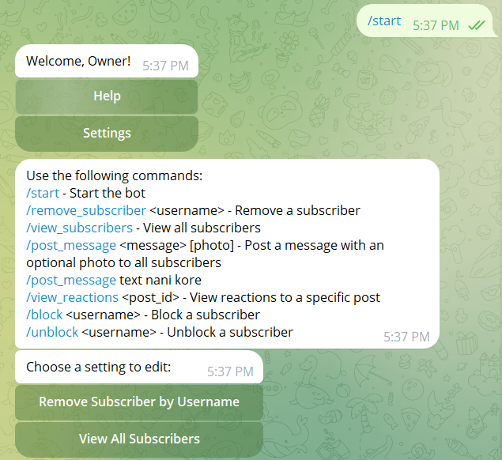
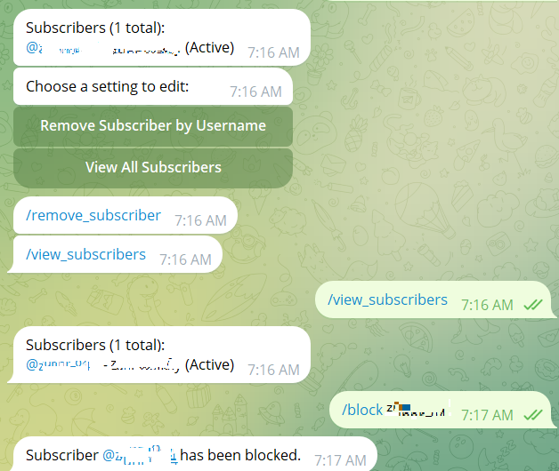
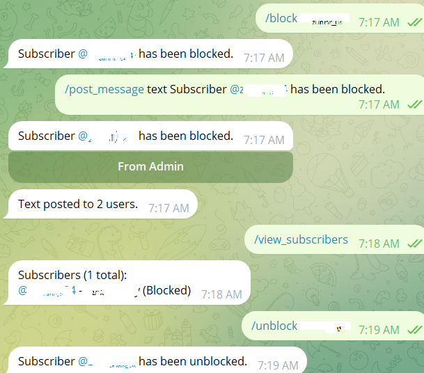

# 𝗪𝗮𝗳𝗶𝘆𝕭𝖔𝖙𝓥2

Welcome to **𝗪𝗮𝗳𝗶𝘆𝕭𝖔𝖙𝓥2**! This Telegram bot allows you to manage subscribers and post messages to all users.

**𝗪𝗮𝗳𝗶𝘆𝕭𝖔𝖙𝓥2** includes features that are not available through BotFather or Manybot.

**𝗪𝗮𝗳𝗶𝘆𝕭𝖔𝖙𝓥2** Does not use promotion message.

## Commands

- **/start:** Start the bot.
- **/remove_subscriber `<username>`:** Remove a subscriber.
- **/view_subscribers:** View all subscribers.
- **/post_message `<message>` `[photo]`:** Post a message with an optional photo to all subscribers.
- **/view_reactions `<post_id>`:** View reactions to a specific post. (not working XD)
- **/block `<username>`:** Block a subscriber.
- **/unblock `<username>`:** Unblock a subscriber.

## Overview

<div>
  
  
  
</div>

## Contributing

Contributions are welcome! Please fork the repository and submit a pull request for any features or bug fixes.

## License

This project is licensed under the MIT License.

## Installation

To run **𝗪𝗮𝗳𝗶𝘆𝕭𝖔𝖙𝓥2** locally, you need to set up the bot environment and install the required dependencies.

1. **Create Your Bot with BotFather:**
   - Go to Telegram and start a chat with [BotFather](https://t.me/botfather).
   - Use the `/newbot` command to create a new bot and follow the instructions to get your bot token.
   - Make sure to store your token securely as you will need it to configure your bot.

2. Clone the repository:
    ```bash
    git clone https://github.com/yourusername/wafiybot.git
    cd wafiybot
    ```

3. Install the dependencies:
    ```bash
    pip install -r requirements.txt
    ```

4. Create a `.env` file and set up your environment variables, including the bot token and any other required settings.

